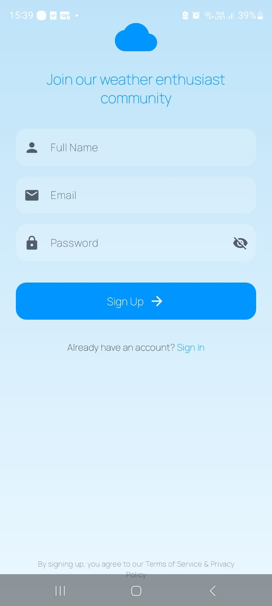
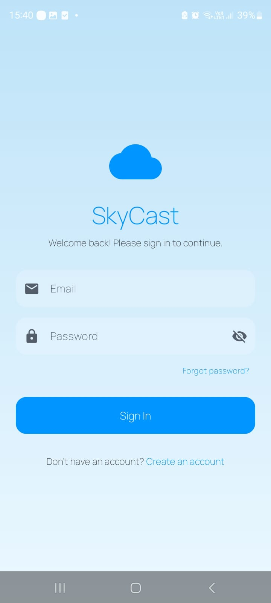
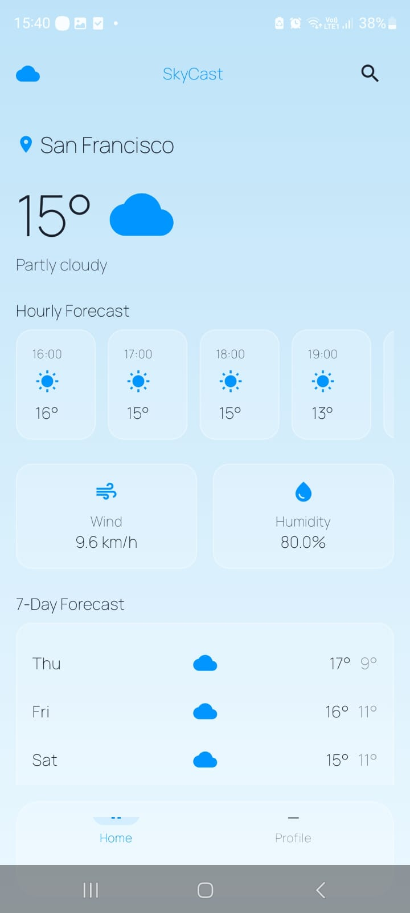
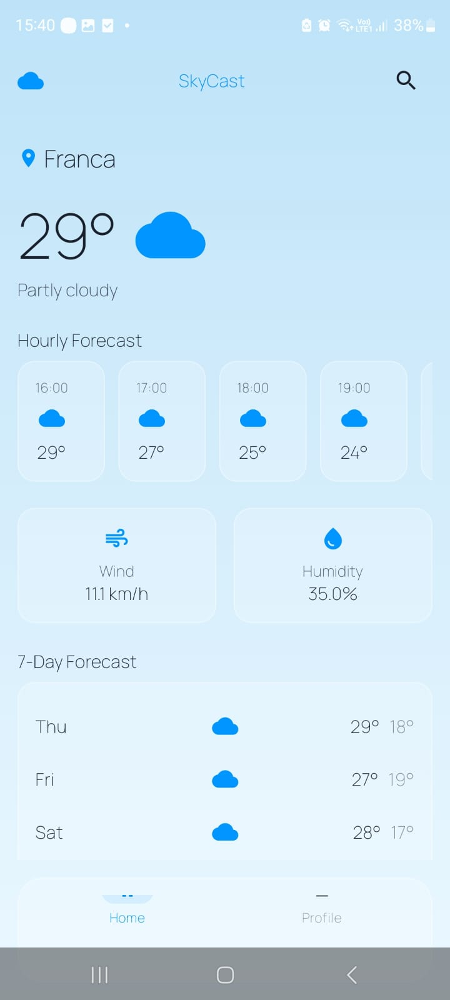
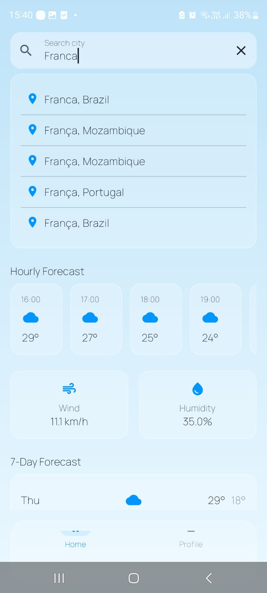
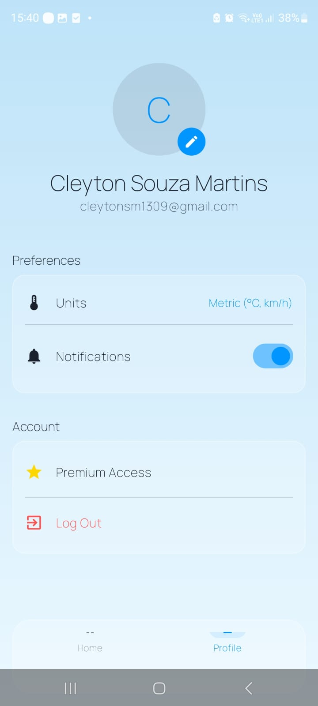

# SkyCast — Weather App

## Sobre o App

O SkyCast fornece dados meteorológicos em tempo real com base em uma localização pesquisada pelo usuário.

---

## Screenshots

<p align="center">
  
  
  
  
  
  
</p>

---

## Funcionalidades

- **Autenticação** — Cadastro e login com e-mail/senha via Firebase Authentication. Sessão persistida: usuários logados vão direto para o app ao reabri-lo.
- **Busca de Cidades** — Pesquisa em tempo real de qualquer cidade do mundo via API de Geocoding. Resultados aparecem em uma lista interativa conforme o usuário digita.
- **Clima Atual** — Temperatura, condição do tempo e ícone correspondente para a cidade selecionada.
- **Previsão Horária** — Carrossel horizontal com temperatura e ícone para as próximas 24 horas.
- **Previsão de 7 Dias** — Lista com máxima, mínima e condição do tempo para cada dia da semana.
- **Widgets de Detalhe** — Cartões de Vento (km/h), Umidade (%) e Qualidade do Ar.
- **Perfil do Usuário** — Exibe nome e e-mail do usuário logado (buscado do Firebase), com preferências de unidade (Métrico/Imperial) e notificações.
- **Logout** — Encerra a sessão e retorna à tela de login.

---

## Tecnologias Utilizadas

| Categoria | Tecnologia |
|---|---|
| Linguagem | Kotlin |
| UI | Jetpack Compose + Material Design 3 |
| Navegação | Navigation Compose |
| Autenticação | Firebase Authentication |
| Rede | Retrofit 2 + Gson Converter |
| API de Clima | [Open-Meteo](https://open-meteo.com/) (gratuita, sem chave) |
| API de Geocoding | [Open-Meteo Geocoding](https://open-meteo.com/en/docs/geocoding-api) |
| Tipografia | Manrope (Google Fonts) |
| Build | Gradle KTS + Version Catalog (`libs.versions.toml`) |

---

## APIs

```
# Clima (forecast)
GET https://api.open-meteo.com/v1/forecast
  ?latitude={lat}&longitude={lon}
  &current=temperature_2m,relative_humidity_2m,wind_speed_10m,weather_code
  &hourly=temperature_2m,weather_code
  &daily=weather_code,temperature_2m_max,temperature_2m_min

# Geocoding (busca de cidades)
GET https://geocoding-api.open-meteo.com/v1/search
  ?name={cidade}&count=5
```

---

## Arquitetura e Estrutura

```
app/src/main/java/com/project/weatherapp/
├── navigation/
│   └── SkyCastNavGraph.kt       # Fluxo Auth → Main com persistência de sessão
├── network/
│   ├── RetrofitInstance.kt      # Instâncias Retrofit (Clima + Geocoding)
│   ├── WeatherApiService.kt     # Endpoint de previsão do tempo
│   ├── WeatherResponse.kt       # Modelos de resposta do clima
│   ├── GeocodingApiService.kt   # Endpoint de busca de cidades
│   └── GeocodingResponse.kt    # Modelos de resposta do geocoding
├── ui/
│   ├── components/
│   │   ├── GlassContainer.kt   # Container com fundo translúcido (Glassmorphism)
│   │   └── GlassTextField.kt   # Campo de texto estilizado
│   ├── screens/
│   │   ├── auth/
│   │   │   ├── SignInScreen.kt
│   │   │   └── SignUpScreen.kt
│   │   ├── home/
│   │   │   └── HomeScreen.kt   # Dashboard com clima, busca e previsões
│   │   ├── profile/
│   │   │   └── ProfileScreen.kt
│   │   └── main/
│   │       └── MainScreen.kt   # Scaffold + Bottom Navigation
│   └── theme/
│       ├── Color.kt
│       ├── Type.kt             # Fonte Manrope
│       └── Theme.kt
└── MainActivity.kt
```

---

## Como Executar
1. Baixa o APK `weatherapp.apk` na raiz do projeto

### OU

1. Clone o repositório e abra no **Android Studio**.
2. Adicione o arquivo `google-services.json` do seu projeto Firebase em `app/`.
3. Ative **Email/Password** como provedor de autenticação no Firebase Console.
4. Execute em um emulador ou dispositivo com **API 24+**.

> Nenhuma chave de API é necessária para o clima — a Open-Meteo é completamente gratuita e open source.
